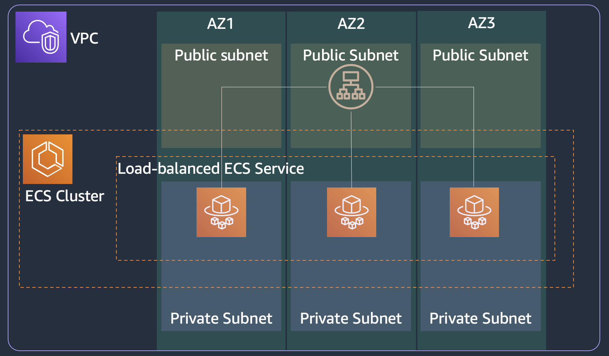

#### Prerequisites

* You can use [AWS Cloud9](https://aws.amazon.com/cloud9/) which has all the prerequisites preinstalled and skip to [Quick Start](#quick-start)
* Mac (tested with OS version 12.+) and AWS Cloud9 Linux machines. We have **not tested** with Windows machines
* [Terraform](https://learn.hashicorp.com/tutorials/terraform/install-cli) (tested version v1.2.5 on darwin_amd64)
* [Git](https://github.com/git-guides/install-git) (tested version 2.27.0)
* [AWS CLI](https://docs.aws.amazon.com/cli/latest/userguide/getting-started-install.html#getting-started-install-instructions)
* AWS test account with administrator role access
* Configure the AWS credentials on your machine by running `aws configure` if you have not already done so.

#### Quick Start

Fork the [ECS blueprints repository on Github](https://github.com/aws-ia/ecs-blueprints)

Clone your forked repository to your laptop/Cloud9 VM.

```shell
git clone https://github.com/<your-repo>/ecs-blueprints.git
```

Start with `core-infra` to create cluster, VPC, and require IAM

```shell
cd ecs-blueprints/examples/core-infra/

terraform init
terraform plan
terraform apply --auto-approve
```

Now we can deploy a load balanced service along with CI/CD pipeline to the above cluster. The following diagram shows the resulting infrastructure:



To deploy:

```shell
cd ../lb-service
terraform init
terraform plan
terraform apply --auto-approve
```

You can use the ALB URL from terraform output to access the load balanced service. The above will give you a good understanding about the basics of ECS Fargate, and ECS service. You can use these as building blocks to create and deploy many ECS services.