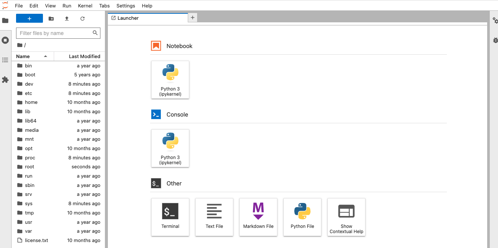

#### About

[Jupyter Notebook](https://jupyter.org/) is a web-based interactive computing platform. It is popular for machine learning and as an IDE for developing in multiple programming languages. JupyterLab is the latest version of Juypter notebook, with a more IDE like experience, and modular, extendable design.

[AWS Inferentia](https://aws.amazon.com/machine-learning/inferentia/) accelerators deliver high performance at the lowest cost for your deep learning (DL) inference applications. When training your models use [AWS Trainium](https://aws.amazon.com/machine-learning/trainium/) Instances, which are optimized for model training.

[AWS Neuron](https://aws.amazon.com/machine-learning/neuron/) is an SDK which runs your machine learning models on the underlying hardware acceleration of AWS Inferentia or AWS Trainium.

This pattern will show how to build and deploy a containerized version of Jupyter notebook, with the AWS Neuron SDK for machine learning, accelerated by AWS Inferentia and AWS Trainium hardware.

::: warning
This pattern is designed to show how to setup a production ready machine learning environment that can be scaled up later for running extremely large machine learning training or inference jobs accelerated by some of the most powerful hardware that AWS has. Therefore this pattern has a fairly high baseline cost (minimum of about $1 an hour, and some instance choices cost >$12 an hour). Consider using [Amazon Sagemaker Notebooks](https://aws.amazon.com/sagemaker/notebooks/) on smaller EC2 instances for a low cost learning environment that is free tier eligible.
:::

#### Setup

If not already installed, ensure that you have the following dependencies installed locally:

* [Docker](https://www.docker.com/) or other OCI compatible container builder
* [Amazon ECR Credential Helper](https://github.com/awslabs/amazon-ecr-credential-helper)
* [AWS SAM CLI](https://docs.aws.amazon.com/serverless-application-model/latest/developerguide/install-sam-cli.html)

#### Architecture

The following diagram shows the architecture of what will be deployed:

!!! @/pattern/jupyter-notebook-inferencing-container-cloudformation/diagram.svg

1. An Application Load Balancer provides ingress from the public internet.
2. Traffic goes to an `inf2.xlarge` AWS Inferentia powered EC2 instance launched by Amazon ECS.
3. Amazon ECS has placed a container task on the instance, which hosts JupyterLab and the AWS Neuron SDK.
4. Amazon ECS has connected the container to the underlying Neuron device provided by the AWS Inferentia instance.
5. Machine learning workloads that you run inside the container are able to connect to the hardware accelerator.
6. Access to the JupyterLab notebook is protected by a secret token that is stored in AWS Secrets Manager. Amazon ECS manages retrieving this secret value and injecting it into the Jupyter server on container startup.

#### Build a Jupyter notebook container

In order to build a Jupyter notebook container image we will start with a prebuilt container image from the AWS Deep Learning Container collection, then install JupyterLab on top of it:

```Dockerfile
FROM 763104351884.dkr.ecr.us-east-2.amazonaws.com/huggingface-pytorch-inference-neuron:1.10.2-transformers4.20.1-neuron-py37-sdk1.19.1-ubuntu18.04
RUN pip install jupyterlab
CMD jupyter-lab
```

Create the `Dockerfile` and then build the custom image locally:

```shell
docker build -t jupyter-notebook .
```

Now we need to create an Amazon Elastic Container Registry:

```shell
aws ecr create-repository --repository-name jupyter-notebook
```

You should get a response similar to this:

```json
{
  "repository": {
      "repositoryUri": "209640446841.dkr.ecr.us-east-2.amazonaws.com/jupyter-notebook",
      "imageScanningConfiguration": {
          "scanOnPush": false
      },
      "encryptionConfiguration": {
          "encryptionType": "AES256"
      },
      "registryId": "209640446841",
      "imageTagMutability": "MUTABLE",
      "repositoryArn": "arn:aws:ecr:us-east-2:209640446841:repository/jupyter-notebook",
      "repositoryName": "jupyter-notebook",
      "createdAt": 1683047667.0
  }
}
```

Copy the `repositoryUri` as this is how you will interact with the repository. Use similar commands to tag your built image and then push it to Amazon ECR:

```shell
docker tag jupyter-notebook 209640446841.dkr.ecr.us-east-2.amazonaws.com/jupyter-notebook:latest
docker push 209640446841.dkr.ecr.us-east-2.amazonaws.com/jupyter-notebook:latest
```

::: info
If you get a `401 Unauthorized` error then make sure you have installed the [Amazon ECR credential helper](https://github.com/awslabs/amazon-ecr-credential-helper) properly. It will automatically use your current AWS credentials to authenticate with the ECR repository on the fly.
:::

#### Define a VPC for the workload

The following CloudFormation file defines a VPC for the workload.

<<< @/pattern/jupyter-notebook-inferencing-container-cloudformation/files/vpc.yml

For more info about this VPC see the pattern ["Large sized AWS VPC for an Amazon ECS cluster"](/large-vpc-for-amazon-ecs-cluster).

#### Define Amazon ECS cluster of AWS Inferentia instances

The following CloudFormation file defines an Amazon ECS cluster that launches AWS Inferentia instances as capacity for running containers. These instances have hardware acceleration that is optimized for running machine learning inferencing jobs.

<<< @/pattern/jupyter-notebook-inferencing-container-cloudformation/files/inferentia-cluster.yml

By default this template deploys `inf2.xlarge` instances. You can launch additional tasks in the Amazon ECS cluster to automatically scale out the number of AWS Inferentia instances. If you plan to run containers that do not need machine learning acceleration, then do not use this pattern, and instead deploy a cluster that uses a less expensive EC2 instance that is compute optimized instead of machine learning optimized.

#### Define the Juypter notebook task

The following CloudFormation template deploys a Jupyter Notebook task under Amazon ECS orchestration:

<<< @/pattern/jupyter-notebook-inferencing-container-cloudformation/files/jupyter-notebook.yml

Some things to note:

You will need to pass the `ImageUrl` parameter so that the stack launches the container image URI that you just uploaded to Amazon ECR. This will be handled later when we deploy the parent stack.

The template creates a `AWS::SecretsManager::Secret` resource as the secret token used to protect the Jupyter notebook from unauthorized access. You will see this token passed in as a `Secret` in the task definition body.

The `MyIp` parameter can be customized to limit which IP addresses are allowed to access the JupyterLab.

#### Deploy all the stacks

We can use the following parent stack to deploy all three child CloudFormation templates:

<<< @/pattern/jupyter-notebook-inferencing-container-cloudformation/files/parent.yml

Use AWS SAM CLI to deploy the parent stack with a command like this one. You will need to substitute in your own `ImageUrl` value from the container image that you built and pushed earlier:

```shell
sam deploy \
  --template-file parent.yml \
  --stack-name machine-learning-environment \
  --resolve-s3 \
  --capabilities CAPABILITY_IAM \
  --parameter-overrides ImageUrl=209640446841.dkr.ecr.us-east-2.amazonaws.com/jupyter-notebook:latest
```

After the deployment finishes you will see an output section that looks similar this:

```txt
-------------------------------------------------------------------------------------------------
Outputs
-------------------------------------------------------------------------------------------------
Key                 Secret
Description         The ARN of the secret token that protects your JuypterLab
Value               arn:aws:secretsmanager:us-east-2:209640446841:secret:JupyterToken-
kZ3MMCCAmjxn-VGGHTz

Key                 JuypterLabUrl
Description         The URL at which you can find your Juypter Lab installation
Value               jupyt-Publi-1U1OSUNR85E3J-297756869.us-east-2.elb.amazonaws.com
-------------------------------------------------------------------------------------------------
```

This tells you the URL where you can access your Juypter Lab notebook, as well as
the details about where you can access to automatically generated secret value that
is the token for accessing your notebook.

#### Get in to the JupyterLab

Open up the [AWS Secrets Manager console](https://us-east-2.console.aws.amazon.com/secretsmanager/listsecrets?region=us-east-2) and look for the secret called `JupyterToken` as
referenced in the outputs section above. After you click on the secret, scroll down and click on "Retrieve Secret Value". Copy the secret value and keep it safe, as this will be the password that you use to get access to your JupyterLab over the internet.

If you wish to change this secret value in AWS Secrets Manager you will need to restart the Amazon ECS JuypterLab task for the change to take effect.

Open up the URL from the outputs section above, and enter the secret token when asked. When it opens you will see a screen similar to this:



At this point you can begin making use of the underlying AWS Inferentia hardware, via the JupyterLab IDE.

#### Make sure that acceleration is available

Inside of JupyterLab click on the "Other -> Terminal" option to open a tab that has a command line prompt. Any commands that you type in this prompt will run inside of the remote JupyterLab container.

Run the following command:

```shell
neuron-ls
```

You should see output similar to this:

```
+--------+--------+--------+---------+
| NEURON | NEURON | NEURON |   PCI   |
| DEVICE | CORES  | MEMORY |   BDF   |
+--------+--------+--------+---------+
| 0      | 2      | 32 GB  | 00:1f.0 |
+--------+--------+--------+---------+
```

This verifies that the AWS Neuron SDK inside of the container is able to connect to the AWS Neuron device, which provides the hardware acceleration of the underlying AWS Inferentia hardware. At this point you can begin to use the Neuron SDK to do machine learning tasks inside of the JupyterLab container.

#### Next Steps

- Currently if you restart the JuypterLab it will wipe all changes that you have made, including any code files you have written. If you would like data that you store inside of your Jupyter notebook to survive ECS task restarts, then consider using the [tutorial on attaching durable storage to an ECS task](cloudformation-ecs-durable-task-storage-with-efs) and use a similar technique to mount a durable Elastic File System to the Jupyter Task.
- Look at the `jupyer-notebook.yml` stack, and notice the `MyIp` parameter. It is currently set to `0.0.0.0/0` which allows inbound traffic from all IP addresses. Look up your home or office IP address and set it like `1.2.3.4/32` to ensure that the JupyterLab only accepts inbound traffic from you and you alone. This adds a second layer of protection in addition to the secret token.
