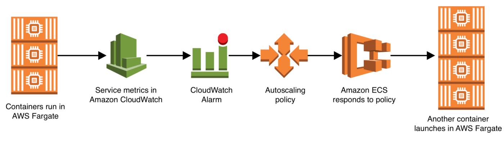

Autoscaling is very important to making sure that your services stay online when traffic increases unexpectedly. In both EC2 and AWS Fargate one way to ensure your service autoscales is to increase and decrease the number of copies of your application container that are running in the cluster.

Autoscaling works like this:

The following template automatically sets up CloudWatch alarms, autoscaling policies, and attaches them to an ECS service.

<<< @/pattern/scale-ecs-service-cloudformation/files/scale-service-by-cpu.yml
